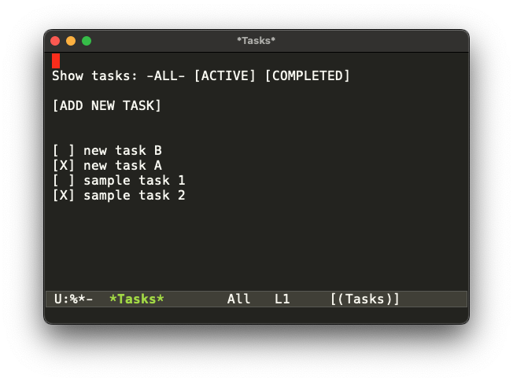

[A few days ago](/blog/posts/2025/a-react-style-structure-for-emacs-special-modes), I gave a simple set of Emacs Lisp macros and functions to rationalize (as far as I'm concerned) the creation of Emacs [special modes](https://www.gnu.org/software/emacs/manual/html_node/elisp/Basic-Major-Modes.html). Recall that special modes are major buffer modes that provide functionality that are not strictly speaking related to editing files. For example, [`dired`](https://www.gnu.org/software/emacs/manual/html_node/emacs/Dired.html) (to list files in a directory and manipulate them) or [`magit`](https://www.masteringemacs.org/article/introduction-magit-emacs-mode-git) (to issue `git` commands on local repository). They function like little apps within Emacs that use buffers to provide user interfaces for specific functionalities.

The macro `defstate` and accompanying functions `getstate` and `setstate` enable the definition of a _state variable_ associated with a buffer in such a way that any update to the state variable triggers a refresh of the buffer, mimicking the way that state updates in a React-based web application trigger a redraw of the components of the web application affected by the updated state. This leads to what I feel is a fairly natural way to structure the code controlling a special mode, at least for the examples that have kept me entertained in my Emacs adventures.

In my post where I talk about `defstate`, I used a trivial counter mode to illustrate the principles involved. Admittedly, that example was pretty unsatisfying. In an effort to better showcase the approach, here is a more involved example that is taken straight from the React tutorials playbook: the [React TodoMatic todo list example](https://developer.mozilla.org/en-US/docs/Learn_web_development/Core/Frameworks_libraries/React_todo_list_beginning) from MDN. You can see the [demo here](https://mdn.github.io/todo-react):

The idea is simple: we use an Emacs buffer to show a list of tasks. Each task has an associated checkbox to indicate and control completion; checking a task marks it as completed, unchecking it marks it back as active (not completed). There are buttons to add tasks, and buttons to filter the tasks list: showing all tasks, showing active tasks, and showing completed tasks. The two features that the TodoMatic demo provide that I will not implement is editing or deleting tasks. I might come back to that kind of functionality later and leave it as an exercise to the reader for now.

I am going to follow the structure of the counter mode I showed last time for this new _tasks_ mode. I am assuming we have the `defstate` macro and the `setstate` and `getstate` functions from [last time](/blog/posts/2025/a-react-style-structure-for-emacs-special-modes). The mode definition itself is unremarkable:

    (define-derived-mode tasks-mode
              special-mode "Tasks"
              "Major mode for managing a tasks list.")

The `tasks` command sets up the buffer and the state variable:

        (defun tasks ()
          (interactive)
          (let* ((name "*Tasks*")
                 (buff (get-buffer-create name)))
            (switch-to-buffer buff)
            (tasks-mode)
            ;; Automatically called by `g` in special modes.
            (setq revert-buffer-function (lambda (&rest ignore) (tasks--render)))
            ;; To navigate buttons using tab/backtab.
            (button-mode)
            ;; Define state variable.
            (defstate **state** (:tasks :show) 'tasks--render)
            ;; Initialize state variable with two sample tasks.
            (setstate :tasks (list (tasks--new-task "sample task 1")
                                   (tasks--new-task "sample task 2"))
                      :show :all)))

        (defun tasks--new-task (name)
          ;; Structure of a task.
          (list :name name :completed nil))

The state `**state**` defined via `defstate` has two state properties: the list of tasks `:tasks` and the filtering requested `:show`. State property `:show` admits three possible values: `:all` (to show all tasks), `:active` (to show only active non-completed, tasks), and `:completed` (to show only completed tasks). A task is represented by a property list with a `:name` and a `:completed` flag indicating whether the task has been completed. Function `tasks--new-task` creates a new active task with a given name. The buffer is initialized with Two sample tasks for illustration purposes.

The implementation of `setstate` ensures that once we initialize the state variable at the end of function `tasks`, a render of the buffer via the registered render function `tasks--render` is triggered:

    (defun tasks--render ()
      (interactive)
      (let* ((inhibit-read-only t)
             (show (getstate :show))
             (tasks (getstate :tasks)))
        (erase-buffer)
        (insert "\nShow tasks: ")
        (tasks--simple-button show :all "ALL" 'tasks-show-all)
        (insert " ")
        (tasks--simple-button show :active "ACTIVE" 'tasks-show-active)
        (insert " ")
        (tasks--simple-button show :completed "COMPLETED" 'tasks-show-completed)
        (insert "\n\n")
        (tasks--simple-button show nil "ADD NEW TASK" 'tasks-create)
        (insert "\n\n\n")
        (dolist (task tasks)
          (let ((completed (plist-get task :completed)))
            (when (or (eq show :all)
                      (and (eq show :active) (not completed))
                      (and (eq show :completed) completed))
              (insert-button (if (plist-get task :completed) "[X]" "[ ]")
                             'face '(:underline nil :inherit default)
                             'task task
                             'action (lambda (btn) (tasks--toggle-task (button-get btn 'task))))
              (insert (format " %s\n" (plist-get task :name))))))
        (goto-char (point-min))))

    (defun tasks--simple-button (show if-show text action-fn)
      (if (and (not (null if-show))
               (eq show if-show))
          (insert (concat "-" text "-"))
        (insert-button (concat "[" text "]")
                       'face '(:underline nil :inherit default)
                       'action-fn action-fn
                       'action (lambda (btn) (call-interactively (button-get btn 'action-fn))))))

There's a lot of interesting stuff happening here. The render function first clears the buffer after temporarily removing the read-only restriction on the buffer,, and then redraws it from scratch. It sets up three buttons (**all**, **active**, and **completed**) at the top of the buffer to control what tasks to show, exactly mirroring the `:show` state property. The option corresponding to the current filter selection is not rendered as a button, but just a string of text, via the `tasks--simple-button` helper function. Aside from the filter buttons, there is also a button to add a new task. 

Buttons are implemented using the [`button` package](https://www.gnu.org/software/emacs/manual/html_node/elisp/Buttons.html) built into Emacs for simplicity. In other projects, I have used the [`widget` package](https://www.gnu.org/software/emacs/manual/html_mono/widget.html) instead. Interestingly, the same conflict that arises in the React community with respect to [controlled versus uncontrolled components](https://dev.to/ale3oula/navigating-reacts-controlled-vs-uncontrolled-components-48kb) arises here as well. Since in this example I can get away with using simple buttons, I will do so and avoid that particular can of worms.

Those buttons invoke commands to perform their action:

        (defun tasks-show-all ()
          (interactive)
          (setstate :show :all))

        (defun tasks-show-active ()
          (interactive)
          (setstate :show :active))

        (defun tasks-show-completed ()
          (interactive)
          (setstate :show :completed))

        (defun tasks-create (task)
          (interactive (list (read-string "New task to create: ")))
          (let* ((tasks (getstate :tasks))
                 (new-task (tasks--new-task task)))
            (setstate :tasks (cons new-task tasks))))

In all those cases, the commands make the obvious update to the appropriate state property and force a re-render, which keeps the content of the buffer in sync with the actions of the user.

_(Helper function `tasks--simple-button` highlights something fun about dynamic scoping. It takes the function to invoke upon pressing the button as a parameter, and because the callback associated with the button expects a `btn` argument while the actions don't, I want to do the usual so-called eta reduction and provide a `(lambda (btn) (call-interactively action-fn))` as the callback to the button, referring to the `action-fn` passed as an argument to the `tasks--simple-button` function. But of course that doesn't work in a dynamic scoping setting, because `action-fn` is a free variable of the `lambda`! I could have switched to lexical scoping for this example, and probably should have because lexical scoping is so much saner, but there is a way to address the issue even in dynamically-scoped Emacs Lisp: add a custom property `'action-fn` to the button that holds the value of the `action-fn` parameter, and use the fact that the current button is passed to the callback and retrieve `action-fn` from the button itself using `(button-get btn 'action-fn)`. Cute trick.)_

After showing the buttons, the render function then loops over all tasks, and for every task that can be shown according to the currently selected filter it adds line to the buffer with first a "checkbox" button showing either `[ ]` or `[X]` depending on whether the task is completed or not and second the name of the task.

The "checkbox" button associated with each task in the buffer has an action that invokes a command to toggle the `:completed` status of the given task before updating the `:task` state property to force a re-render of the buffer. That re-render will of course show the "checkbox" button of that task with the now updated `:completed` status:

        (defun tasks--toggle-task (task)
          (let ((completed (plist-get task :completed)))
            (plist-put task :completed (not completed))
            (setstate :tasks (getstate :tasks))))
            
Forcing a re-render by writing the `:tasks` value back to the state property is inelegant, but I can live with it. Welcome to the ungainly world of mutable state.

The only thing that now remains to complete this special mode example is to create a few key
bindings to tie actions to keys, such as creating a new task or changing the filters:

    (define-key tasks-mode-map (kbd "n") 'tasks-create)
    (define-key tasks-mode-map (kbd "a") 'tasks-show-all)
    (define-key tasks-mode-map (kbd "c") 'tasks-show-active)
    (define-key tasks-mode-map (kbd "d") 'tasks-show-completed)
    
And that's it! The complete code for this example is [available](./defstate-tasks.el).

As I mentioned earlier, the original TodoMatic React demo has functionality to edit and delete tasks. The _easiest_ way to replicate thos features is to provide buttons associated with each task for editing (using the minibuffer to input the new task name) and deleting. Those can be handled similarly to the "checkbox" buttons, except invoking an editing or deleting command on the task instead of updating the completed status of the task.

Emacs has a native [todo mode](https://www.gnu.org/software/emacs/manual/html_mono/todo-mode.html), so there is no point really belaboring this example. But if you're looking for an interesting exercise to practice hacking Emacs special modes, consider extending this example with the ability to anchor tasks to a file: the `tasks` function can take a file as input (creating it as needed), tasks can be read from that file, and the file can either be saved manually when the user presses a key or automatically after every update.

