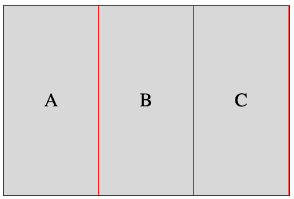
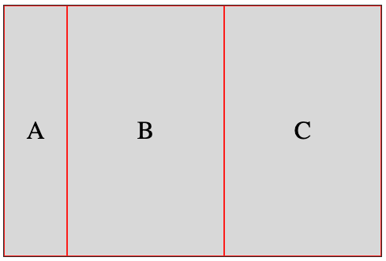
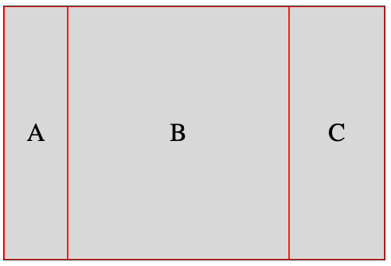
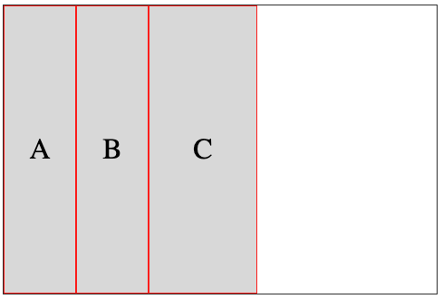
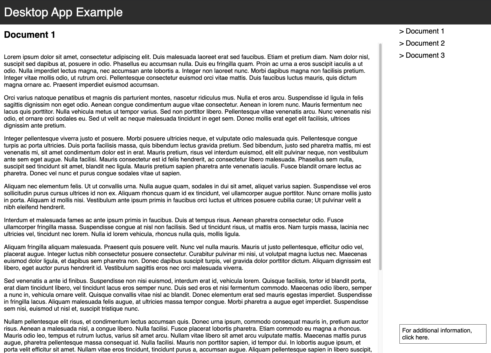

[Last time](/blog/posts/2026/05-web-pages-vs-desktop-apps/) I talked about using desktop app layouts for web applications, where the intuition is to use the browser viewport as the central design principle instead of the page that is the default for the web.

How do we support that sort of layout in a nicely generic way? Obviously we can do this in CSS via [flexbox](https://developer.mozilla.org/en-US/docs/Web/CSS/Guides/Flexible_box_layout/Basic_concepts) or [grid](https://developer.mozilla.org/en-US/docs/Web/CSS/Guides/Grid_layout/Basic_concepts) and a careful management of width and height. But we can also take inspiration from desktop user interface toolkits. Recently, I've been revisiting an old toolkit for [Concurrent ML](https://people.cs.uchicago.edu/~jhr/papers/cml.html) called [eXene](https://alleystoughton.us/eXene/index.html), developed in part as a way to study the use of concurrency to develop user interfaces. (The reason why I'm revisiting this toolkit I may discuss in the future.) EXene supports a user interface widget called a _box layout_ that lets you lay out other widgets automatically into a box area in a way reminiscent of a flex box layout.

It has enough differences though that it is worth describing here, if only to examine an alternative approach to layout. The biggest difference is that a box layout takes the overall size of the area into account, especially the height. I implemented it as a small Javascript library with an accompanying CSS file, to illustrate in practice.

Basically, a box layout is a widget that, given a height and width, wraps around other widgets, called box widget. A box widget is one of three kinds:

- a generic widget
- a horizontal layout of box widgets
- a vertical layout of box widgets

A generic widget is just any user interface element. A horizontal layout is like a row flex box, while a vertical layout is like a column flex box. The difference is the management of sizes, though even that could theoretically be done with the flex box model. This is just a slightly different setup. By default, a box layout is a vertical layout, so whatever subwidgets it has will be lined up vertically.

Every box widget has an optional minimum and maximum width and height. By default, a box widget will shrink or expand to fill however much room it is allotted by its container, unless it hits the minimum or maximum width or height. Therefore, a generic widget used as a box widget will expand to fill the full height and width of its container unless there is a maximum height or width. The interesting action happens in the horizontal or vertical layouts. For those, they again expand to take the available space in their container (subject to maximum heights and widths), but the space _within_ the layout will be distributed to the subwidgets according to a specific algorithm.

I implemented a variant of the eXene layout algorithm for horizontal and vertical layouts: subwidgets all start at their minimum width for a horizontal layout (resp., minimum height for a vertical layout), then they are grown uniformly until any of them hits their maximum width (resp., height) at which they point they stop growing and the remaining space in the layout is distributed among the remaining "growable" subwidgets using the same process until all the space is exhausted, or all the subwidgets have reached their maximum size. This means, in particular, that the size of a box widget depends only on its parent and its siblings, and not its subwidgets.

Thus, for example, if we define a box layout of width 480px with a horizontal layout box widget with three subwidgets A, B, C without any maximum width, then the algorithm will distribute the space uniformly across all subwidgets, 160px each:

(There is a black border around the full box layout widget and a red border around every subwidget.) If we put a maximum width of 80px on subwidget A, then then remaining space (400px) will be split between B and C with 200px each.

If we put an additional maximum width of 120px on C, then the remaining space of 280px will be allotted to B:

Finally, if we put an additional maximum, width of 80px on B, then the remaining space is not allotted, and is available at the right of the box layout:

Everything applies symmetrically to minimum widths, with the additional caveat that if the minimum width of widgets does not fit within the allotted space of the container, whatever overflows is hidden. We can add a scroll bar as usual via the `overflow` CSS property. Honestly, this is the part where using it in practical applications will suggest what is the most useful behavior. I'll leave that to future investigations. For a vertical layout box widget, replace width by height in the above overview.

As I said, I have implement a prototype version of the above in Javascript with a set of <a href="./box-layout.css">CSS classes</a> and a <a href="./box-layout.js">Javascript file</a>, where HTML elements are basically interpreted as widgets. The Javascript file offers an initialization function that loops through every box layout and force a refresh of the layout based on the algorithm above, and also registers a callback on the `resize` event to maintain the layout after a change in browser viewport size. (There is some throttling of the events so that we don't force a refresh on every `resize` event, but only once the resizing has stopped for 200 milliseconds.) The classes implemented are simply:

- `box-layout` for the box layout widget itself, the container of the layout
- `box-hz` for a horizontal box layout widget
- `box-vt` for a vertical box layout widget

Any HTML element will be interpreted as a user interface widget. Additional data attributes `data-min-height`, `data-max-height`, `data-min-width`, and `data-max-width` can be used to impose minimum and maximum height and width on widgets within the box layout container, with `data-height` and `data-width` as a shorthand for setting the minimum and maximum to the same value. 

As an example, here are the four sample horizontal layouts I described above:

    

      

        
A

        
B

        
C

      

    

 
    

      

        
A

        
B

        
C

      

    

 
    

      

        
A

        
B

        
C

      

    

    
    

      

        
A

        
B

        
C

      

    

We can recreate the sample desktop app example I created from first principles last time:

Again, this is a prototype. Right now, it can handle padding within elements in a reasonable way, but does not play so well margins withi elements in the box layout. Which is not entirely surprising, as margins interact with heights and widths in subtle ways. My guess is that margins needs to be taken into account within the box layout model itself. I'll keep this for future consideration. But at least padding works, which is probably more useful within a box layout.
