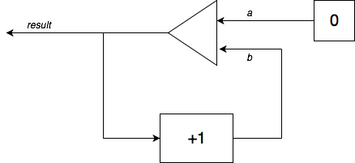
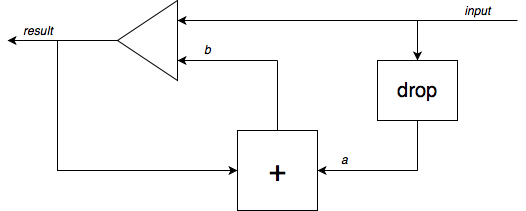

# Homework 8

## Due Date: Thursday, December 10, 2020 (23h59)

- This homework is to be done individually. You may discuss problems
with fellow students, but all submitted work must be entirely your
own, and should not be from any other course, present, past, or
future. If you use a solution from another source you must cite it
&mdash; this includes when that source is someone else helping
you.

- **Please do not post your solutions on a
public website or a public repository like GitHub.**

- All programming is to be done in OCaml v4.

- Code your answers by modifying the file
[`homework8.ml`](homework8.ml) provided. Add your **name**, your
**email address**, and any **remarks** that you wish to make to the
instructor to the block comment at the head of the file.

- **Please do not change the types in the signature of the
function stubs I provide**. Doing so will make it
impossible to load your code into the testing infrastructure,
and make me unhappy.

- Feel free to define helper functions if you need them.

## Electronic Submission Instructions

- Start a _fresh_  OCaml shell.

- Load your homework code via `#use "homework8.ml";;` to make sure that there will be no errors when I load your code.

- If there are any error, do not submit. I can't test what I can't `#use`.

- When you're ready to submit, send an email with your file
`homework8.ml` as an attachment to `olin.submissions@gmail.com` with
subject _Homework 8 submission_.

* * *

We are going to provide ways to construct dataflow networks as we saw in class, but textually. Consider the following primitive components that I described in class:

- **cst**: create a constant stream of values
- **map**: map a function on an input stream to produce an output stream
- **map2**: map a function over two input streams to produce an output stream
- **fby**: take two input streams and produce an output stream made up of the first element of the first input stream followed by all the elements of the second input stream
- **drop**: take an input stream and produce  an output stream made up of the input stream but starting at its second element.

Consider the following dataflow network for computing the infinite
stream of natural numbers starting from 0: 

The basic idea is pretty simple: we give a name to every wire in a
dataflow network, and associate with each wire the primitive
component that gives the wire its values. In the above diagram,
there are basically three wires, called _a_, _b_,
and _result_. Wire _a_ gets its values from the constant
component that always sends 0, wire _b_ gets its values from
the map component that adds 1 to its input, and the _result_
component gets its values from the followed-by component. Each
primitive component takes its inputs from wires (except for cst,
which has no inputs). The followed-by component takes its inputs
from wires _a_ and _b_, and the map component takes its
input from the _result_ wire. (Note that the _result_
wire forks into two, but since the same values flow on both forks,
we give it a single name.)

This means that we can represent the above dataflow network using the
following list of wires and components giving values to those wires:

> _result_ &larr; `fby` _a_ _b_  
> _a_ &larr; `cst` `0`  
> _b_ &larr; `map` `(fun x -> x +1)` _result_  
    
The dataflow network as a whole has no inputs, and its output is
the _result_ wire. In the notation of the homework, it is
constructed using the code:

    let nats = network [] "result" [
      ("result", fby "a" "b");
      ("a", cst 0);
      ("b", map (fun x -> x+1) "result")
    ]
The order of the wire definitions does not matter.
    
The primitive components I give you include those we saw in class:

    cst : 'a -> 'a primitive
    map : ('a -> 'a) -> string -> 'a primitive
    map2 : ('a -> 'a -> 'a) -> string -> string -> 'a primitive
    fby : string -> string -> 'a primitive
    drop : string -> 'a primitive
    
Additionally, I give you two more primitive components that turn out to be useful:
    
    first : string -> 'a primitive
    filter : ('a -> 'a -> bool) -> string -> string -> 'a primitive
    
`first` takes an input stream and produces an output stream made of
the first element of the input stream repeated over and over
again. (In a sense, it is the dual of `drop`.) The primitive `filter`
takes a predicate and two input streams and produces an output stream
by taking an element from each stream and putting the element of the
second stream into the output stream if the predicate applied to both
elements returns true.

Function `network` with type `string list -> string ->
(string * 'a primitive) list -> 'a network` is used to construct
a network from primitives: the result
of `network` _`inputs`_ _`output`_ _`descr`_ is a
dataflow network with input wires _`inputs`_, output
wire _`output`_, and description _`descr`_
given as a list of pairs of a wire and the primitive component that
gives it its value.

One final primitive exists, to allow you to reuse a network as a
component inside another network:
  
    component : 'a network -> string list -> 'a primitive

Primitive `component` _`net`_ _`args`_ includes dataflow
network _`net`_ in your network, attaching the wires supplied as
arguments in _`args`_ to the input wires of _`net`_. The
output wire of _`net`_ is the output wire of the primitive. (Wires
with the same name will be considered different in the dataflow
network included, and should not clash &mdash; the same way you can
use the same local variable names in a helper function that you're
calling from another function and they will not clash.)

By way of example, consider the following super simple dataflow
network to add two streams of integers, pointwise
  
    let add = network ["input1";"input2"] "result" [
      ("result", map2 (fun x y -> x+y) "input1" "input2")
    ]

You can use that component inside the dataflow network to compute
the partial sums of a streams as we saw in class,
taking a stream _a1 a2 a3 ..._ and producing _a1 (a1+a2)
(a1+a2+a3) ..._. This is the network I drew in class:

  

It can be captured as follows in the above syntax:

    let psums = network ["input"] "result" [
      ("result", fby "input" "b");
      ("a", drop "input");
      ("b", component add ["a";"result"])
    ]
    
How do you get a dataflow network to compute? For a **dataflow
network with no input streams**, you can simply use
function `prefix`:
      
    prefix : int -> 'a network -> 'a list
    
where `prefix` _`n`_ _`net`_ takes a number _`n`_ and
a dataflow network _`net`_ (having no input streams) and returns
the first _`n`_ elements produced on the output wire
of _`net`_. Thus, for example:

    # prefix 20 nats;;
    - : int list = [0; 1; 2; 3; 4; 5; 6; 7; 8; 9; 10; 11; 12; 13; 14; 15; 16; 17; 18; 19]
    # prefix 20 squares;;
    - : int list = [1; 4; 9; 16; 25; 36; 49; 64; 81; 100; 121; 144; 169; 196; 225; 256; 289; 324; 361; 400]

Another useful testing function is `nth`:

    nth : int -> 'a network -> 'a
    
where `nth` _`n`_ _`net`_ takes a number _`n`_ and
a dataflow network _`net`_ (having no input streams) and returns
the _`n`_th element of the stream produced on the output wire
of _`net`_. Thus, for example:

    # nth 0 nats;;
    - : int = 0
    # nth 100 nats;;
    - : int = 100
    # nth 1000 nats;;
    - : int = 1000
    # nth 0 squares;;
    - : int = 1
    # nth 100 squares;;
    - : int = 10201

What about networks that expect one or more input streams? We can't
apply `prefix` directly. What we can do is supply streams to
the input wires of the network. Function `apply` is provided for that purpose:

    apply : 'a network -> 'a network list -> 'a network

where `apply` _`net`_ _`input_nets`_ takes a dataflow
network _`net`_ and hooks up its inputs to the output of
each of the networks in list _`input_nets`_, each of which
better be a dataflow network without inputs. The result is a new
dataflow network with no inputs, which we can query the output wire of
using `prefix`. For example:

    # prefix 20 (apply psums [nats]);;
    - : int list = [0; 1; 3; 6; 10; 15; 21; 28; 36; 45; 55; 66; 78; 91; 105; 120; 136; 153; 171; 190]
    # prefix 20 (apply psums [squares]);;
    - : int list = [1; 5; 14; 30; 55; 91; 140; 204; 285; 385; 506; 650; 819; 1015; 1240; 1496; 1785; 2109; 2470; 2870]

One final note: the dataflow networks this code lets you write are
what we might call **homogeneous dataflow networks**. Every wire in the
network must carry values of the same type, represented by the type
associate with a network. For instance, a dataflow network of type
`int network` carries values of type `int`, while a `float network`
carries values of type `float`. (These are the two types of networks
that we use in this homework.) This imposes some practical limitations
on what we can implement without resorting to encoding tricks. This is
not a limitation of dataflow networks proper, but rather how we decided
to implement them in OCaml.
  

* * *

## Question 1: Basic Stream Manipulation

### (A)

Code a dataflow network **`scale`**
of type **`int network`** with one input
such that `scale` takes an input stream and produces
a stream obtained by multiplying every element of the
input stream by `n`:

> `(scale n) <a1 a2 a3 ...> = <n*a1 n*a2 n*a3 ...>`

    # prefix 20 (apply (scale 0) [nats]);;
    - : int list = [0; 0; 0; 0; 0; 0; 0; 0; 0; 0; 0; 0; 0; 0; 0; 0; 0; 0; 0; 0]
    # prefix 20 (apply (scale 3) [nats]);;
    - : int list = [0; 3; 6; 9; 12; 15; 18; 21; 24; 27; 30; 33; 36; 39; 42; 45; 48; 51; 54; 57]
    # prefix 20 (apply (scale 3) [evens]);;
    - : int list = [0; 6; 12; 18; 24; 30; 36; 42; 48; 54; 60; 66; 72; 78; 84; 90; 96; 102; 108; 114]
    # prefix 20 (apply (scale 3) [stairs 4]);;
    - : int list = [0; 3; 6; 9; 0; 3; 6; 9; 0; 3; 6; 9; 0; 3; 6; 9; 0; 3; 6; 9]

### (B)

Code a network **`mult`** of
type **`int network`** with two inputs such that `mult` produces the
stream obtained by multiplying the corresponding
elements of the input streams:

> `mult <a1 a2 a3 ...> <b1 b2 b3 ...> = <a1*b1 a2*b2 a3*b3 ...>`

    # prefix 20 (apply mult [nats;nats]);;
    - : int list = [0; 1; 4; 9; 16; 25; 36; 49; 64; 81; 100; 121; 144; 169; 196; 225; 256; 289; 324; 361]
    # prefix 20 (apply mult [nats;evens]);;
    - : int list = [0; 2; 8; 18; 32; 50; 72; 98; 128; 162; 200; 242; 288; 338; 392; 450; 512; 578; 648; 722]
    # prefix 20 (apply mult [evens;evens]);;
    - : int list = [0; 4; 16; 36; 64; 100; 144; 196; 256; 324; 400; 484; 576; 676; 784; 900; 1024; 1156; 1296; 1444]
    # prefix 20 (apply mult [evens;stairs 4]);;
    - : int list = [0; 2; 8; 18; 0; 10; 24; 42; 0; 18; 40; 66; 0; 26; 56; 90; 0; 34; 72; 114]

### (C)

Code a function **`fold`** of
type **`('a -> 'a -> 'a) -> 'a
network`** where `fold f` returns a dataflow
network with two inputs _s_ and _t_ that produces the stream
obtained by the result of calling `f` over each
element of _t_, passing in the
previous value of the resulting stream as well. The
initial "previous" value is the first element of _s_.

> `(fold f) <i1 i2 i3 ...> <a1 a2 a3 ...> = (f a1 i1) (f a2 (f a1 i1)) (f a3 (f a2 (f a1 i1))) ...>`

    # prefix 20 (apply (fold (fun a r -> a + r)) [nats; nats]);;
    - : int list = [0; 1; 3; 6; 10; 15; 21; 28; 36; 45; 55; 66; 78; 91; 105; 120; 136; 153; 171; 190]
    # prefix 20 (apply (fold (fun a r -> a + r)) [nats; evens]);;
    - : int list = [0; 2; 6; 12; 20; 30; 42; 56; 72; 90; 110; 132; 156; 182; 210; 240; 272; 306; 342; 380]
    # prefix 10 (apply (fold (fun a r -> a * r)) [odds;odds]);;
    - : int list = [1; 3; 15; 105; 945; 10395; 135135; 2027025; 34459425; 654729075]
    - : unit = ()

### (D)

Code a dataflow network **`running_max`**
type **`int network`** with one input _s_ which produces
the stream consisting of the maximum value in _s_ seen from the start of _s_:
	    
> `running_max <a1 a2 a3 ...> = <max(a1) max(a1,a2) max(a1,a2,a3) ...>`

    # prefix 20 (apply running_max [nats]);;
    - : int list =
    [0; 1; 2; 3; 4; 5; 6; 7; 8; 9; 10; 11; 12; 13; 14; 15; 16; 17; 18; 19]
    # prefix 20 (apply running_max [stairs 3]);;
    - : int list = [0; 1; 2; 2; 2; 2; 2; 2; 2; 2; 2; 2; 2; 2; 2; 2; 2; 2; 2; 2]
    # prefix 20 (apply running_max [stairs 5]);;
    - : int list = [0; 1; 2; 3; 4; 4; 4; 4; 4; 4; 4; 4; 4; 4; 4; 4; 4; 4; 4; 4]
    # prefix 20 (apply running_max [apply add [stairs 4; nats]]);;
    - : int list = [0; 2; 4; 6; 6; 6; 8; 10; 10; 10; 12; 14; 14; 14; 16; 18; 18; 18; 20; 22]
    # prefix 20 (apply running_max [apply add [stairs 3; stairs 5]]);;
    - : int list = [0; 2; 4; 4; 5; 5; 5; 5; 5; 5; 5; 5; 5; 5; 6; 6; 6; 6; 6; 6]

* * *

## Question 2: Numerical Analysis

Many problems in numerical analysis involve finding better and better
approximations to a desired value (such as &pi; or _e_,
or the solution to a differential equation) until the difference
between successive approximations gets small enough that we decide
that we have converged and report that we have found the value we're
looking for. 

Infinite streams help in this context because we can represent the 
successive approximations to a value by a stream of those
approximations.

In this question, we will mostly be dealing with streams of floating 
point numbers. To make your life a bit easier, you may want to code dataflow
networks such as `natsf`, `scalef`, `addf`, and `psumsf` 
that basically do what `nats`, `scale`, `add`,
and `psums` do, but with floating point numbers instead of
integers. 

### (A)

How do you compute the value of &pi;? One way is to
use trigonometry. One of the earliest approaches uses the
fact that tan &pi;/4 = 1. Using arctan,
the inverse tan function, 
we can express this as &pi;/4 = arctan 1, that
is, &pi; = 4 arctan 1.
	    
Why  does that help us? The Taylor expansion of arctan at x
	      tells us that
          
> arctan x = x/1 - x3/3 + x5/5 - x7/7 + ...
          
This is an infinite sum, but it can be approximated by
the stream of partial sums

> < x/1 &nbsp;&nbsp;&nbsp; (x/1 - x3/3)  &nbsp;&nbsp;&nbsp; (x/1 - x3/3 + x5/5) &nbsp;&nbsp;&nbsp;  (x/1 - x3/3 + x5/5 - x7/7)  &nbsp;&nbsp;&nbsp; ...> &nbsp;&nbsp;&nbsp;&nbsp; (*)

which gets closer and closer to arctan x.

Code a function **`arctan`** with type
**`float -> float network`**
where `arctan x` returns a dataflow network
producing the stream of approximations to
arctan x given by (*) above.

    # prefix 20 (arctan 0.0);;
    - : float list =
    [0.; 0.; 0.; 0.; 0.; 0.; 0.; 0.; 0.; 0.; 0.; 0.; 0.; 0.; 0.; 0.; 0.; 0.; 0.;
     0.]
    # prefix 20 (arctan 1.0);;
    - : float list =
    [1.; 0.666666666666666741; 0.866666666666666696; 0.723809523809523903;
     0.834920634920635063; 0.744011544011544124; 0.820934620934621107;
     0.754267954267954455; 0.813091483679719174; 0.760459904732350811;
     0.808078952351398483; 0.764600691481833294; 0.80460069148183333;
     0.767563654444796351; 0.802046413065486; 0.769788348549357;
     0.800091378852387236; 0.771519950280958655; 0.798546977307985628;
     0.77290595166696]
    # prefix 20 (apply (scalef 4.0) [arctan 1.0]);;
    - : float list =
    [4.; 2.66666666666666696; 3.46666666666666679; 2.89523809523809561;
     3.33968253968254025; 2.97604617604617649; 3.28373848373848443;
     3.01707181707181782; 3.25236593471887669; 3.04183961892940324;
     3.23231580940559393; 3.05840276592733318; 3.21840276592733332;
     3.0702546177791854; 3.20818565226194385; 3.07915339419742784;
     3.20036551540954894; 3.08607980112383462; 3.19418790923194251;
     3.09162380666784]
    # nth 1000 (apply (scalef 4.0) [arctan 1.0]);;
    - : float = 3.14259165433954424

The last example shows that this way of computing &pi; converges very
slowly. After 1000 terms into the stream, we're still only at
3.142591... which is pretty far from 3.141592...

A more efficient way to compute &pi; is to use the following formula:
	    
> &pi;/4 = 4 arctan (1/5) - arctan (1/239) 

and thus
	    
>  &pi; = 16 arctan (1/5) - 4 arctan (1/239)  &nbsp;&nbsp;&nbsp;&nbsp; (**)

Again, we know each of the arctan can be approximated by the stream
(*), and thus &pi; can be
approximated by the difference of the two streams, each properly scaled.

Code a dataflow network **`pi`** with type **`float network`**
which produces the stream providing
approximations to &pi; using (**)

    # prefix 20 pi;;
    - : float list =
    [3.18326359832636; 3.14059702932606033; 3.14162102932503462;
     3.14159177218217733; 3.14159268240439937; 3.14159265261530862;
     3.141592653623555; 3.14159265358860251; 3.14159265358983619;
     3.14159265358979223; 3.141592653589794; 3.141592653589794;
     3.141592653589794; 3.141592653589794; 3.141592653589794; 3.141592653589794;
     3.141592653589794; 3.141592653589794; 3.141592653589794; 3.141592653589794]
    # nth 100 pi;;
    - : float = 3.141592653589794
    # nth 1000 pi;;
    - : float = 3.141592653589794

### (B)

Newton's method is a way to find a zero of a polynomial with one
unknown, such as 10x+20. (In fact, it works for any differentiable function of one argument.)
Recall that a zero of a polynomial f(x) is a
value v that makes f(v)=0. To compute &radic;10,
for instance, we can use Newton's method to find a zero of
x2-10. To compute &#x221b;20 we find a zero of
x3-20, and so on.

What is Newton's method? It says that to find a zero of f(x), we
need the derivative of f, written f'(x), as well as an initial
guess x0. The guess doesn't have to be a good guess. Once we have a
guess x0, we can improve the guess by computing x1, x2, x3, ..., as follows:

> xn+1 = xn - f(xn)/f'(xn)  &nbsp;&nbsp;&nbsp;&nbsp;  (***)

where xi is the ith guess. Each
guess gets closer and closer to a zero of f(x).

Code a function **`newton`** with type
**`(float -> float) -> (float -> float) -> 
float -> float network`** where `newton f df
guess` returns a dataflow network that produces
the stream of approximations of guesses given by 
(***) for function `f` with its
derivative `df` and an initial
guess `guess`.

    # prefix 10 (newton (fun x -> 3. *. x -. 2.) (fun x -> 3.) 1.);;
    - : float list =
    [1.; 0.666666666666666741; 0.666666666666666741; 0.666666666666666741;
     0.666666666666666741; 0.666666666666666741; 0.666666666666666741;
     0.666666666666666741; 0.666666666666666741; 0.666666666666666741]
    
    # let sqrt v = newton (fun x -> x *. x -. v) (fun x -> 2. *. x) 1.0;;
    val sqrt : float -> float network = <fun>
    
    # prefix 10 (sqrt 4.);;
    - : float list =
    [1.; 2.5; 2.05; 2.00060975609756087; 2.00000009292229475;
     2.00000000000000222; 2.; 2.; 2.; 2.]
    # prefix 10 (sqrt 9.);;
    - : float list =
    [1.; 5.; 3.4; 3.0235294117647058; 3.00009155413138; 3.00000000139698386; 3.;
     3.; 3.; 3.]
    # prefix 10 (sqrt 2.);;
    - : float list =
    [1.; 1.5; 1.41666666666666674; 1.41421568627450989; 1.41421356237468987;
     1.41421356237309515; 1.41421356237309492; 1.41421356237309515;
     1.41421356237309492; 1.41421356237309515]
    # prefix 10 (sqrt 3.);;
    - : float list =
    [1.; 2.; 1.75; 1.73214285714285721; 1.7320508100147276; 1.73205080756887719;
     1.73205080756887742; 1.73205080756887719; 1.73205080756887742;
     1.73205080756887719]
    # prefix 10 (sqrt 144.);;
    - : float list =
    [1.; 72.5; 37.2431034482758605; 20.5547955554420376; 13.7802299905638;
     12.11499150672641; 12.0005457307424379; 12.0000000124086874; 12.; 12.]

### (C)

Given that we talked about derivatives in (b), how about
computing derivatives? It is itself an approximate process. More
specifically, the value of the derivative of a function f at a
point x0 can be approximated by the stream:

> < f(x0+1)-f(x0) &frasl; 1   &nbsp;&nbsp;&nbsp;
f(x0+&frac12;)-f(x0) &frasl; &frac12;   &nbsp;&nbsp;&nbsp;
f(x0+&frac13;)-f(x0) &frasl; &frac13;   &nbsp;&nbsp;&nbsp;
...>  &nbsp;&nbsp;&nbsp;&nbsp;  (****)

where the nth term in the sequence is:

> f(x0+(1/n))-f(x0) &frasl; (1/n)

Code a function **`derivative`** with type
**`(float -> float) -> float -> float network`**
where `derivative f x` returns a dataflow
network that produces the  stream of approximations of the
derivative of `f` at point `x` given by (****).

    # prefix 10 (derivative (fun x-> x *. x) 4.0);;
       (* The derivative of x^2 is just 2x *)
    - : float list =
    [9.; 8.5; 8.33333333333332504; 8.25; 8.20000000000000284;
     8.16666666666668561; 8.14285714285715656; 8.125; 8.11111111111107519;
     8.09999999999998721]
    # nth 1000 (derivative (fun x -> x *. x) 4.0);;
    - : float = 8.00099900099941408
    # prefix 10 (derivative (fun x-> x *. x +. 10.0) 4.0);;
        (* The derivative of x^2 + 10 is still just 2x *)
    - : float list =
    [9.; 8.5; 8.33333333333332504; 8.25; 8.20000000000000284;
     8.16666666666668561; 8.14285714285715656; 8.125; 8.11111111111107519;
     8.09999999999998721]
    # prefix 10 (derivative (fun x -> 3.0 *. x) 4.0);;
        (* The derivative of 3x is 3 *)
    - : float list =
    [3.; 3.; 3.; 3.; 3.00000000000000711; 3.; 3.00000000000001421; 3.;
     2.99999999999998934; 2.99999999999998934]
    # prefix 10 (derivative (fun x-> x *. x *. x +. x *. x +. 2.0 *. x) 2.0);;
       (* The derivative of x^3 + x^2 + 2x is 3x^2 + 2x + 2 *)
    - : float list =
    [26.; 21.75; 20.4444444444444606; 19.8125; 19.4400000000000261;
     19.1944444444444144; 19.0204081632652766; 18.890625; 18.7901234567901305;
     18.7100000000000222]
     
**Thought questions:** (You don't have to answer them, but you may want to think about them) _Could you somehow modify function `newton` so that it doesn't require you to provide the first derivative of the function for which you want to find a root? Perhaps you could compute the derivative automatically using `derivative`? Also: `derivative` converges horribly. Could you think of a way to improve it?_

### (D)

All of the above questions return streams yielding better and
better approximations to a desired value. By picking out an
element of the stream far enough down, we can find a good
approximation to the value we want.

But how far do we go? Approximations get closer and closer to the
value they approximate, which means that the difference between
successive approximations gets smaller and smaller. So we can look into
the stream and try to find the first approximation which differs from
the next approximation by a small enough margin to decide
that we have converged to the desired value, and take that as the
desired approximation. Since we can make the margin as small as we
want, we can get approximation that are as close as we want to the
actual value we seek. (All of this assuming that the
stream actually converges to the desired value. What
happens if the stream does _not_ converge?)

Code a function **`limit`** with type
**`float -> float network`**
where `limit epsilon s` returns a dataflow
network with one input `s` which produces the stream
of elements of `s` that differ from their subsequent
element by less than `epsilon` (in absolute value).

    # prefix 10 (apply (limit 0.00000000001) [pi]);;
    - : float list =
    [3.14159265358860251; 3.14159265358983619; 3.14159265358979223;
     3.141592653589794; 3.141592653589794; 3.141592653589794; 3.141592653589794;
     3.141592653589794; 3.141592653589794; 3.141592653589794]
    # prefix 10 (apply (limit 0.00000000001)
                   [newton (fun x -> x *. x -. 10.) (fun x -> 2. *. x) 1.]);;
    - : float list =
    [3.16227766016837952; 3.16227766016837908; 3.16227766016837952;
     3.16227766016837908; 3.16227766016837952; 3.16227766016837908;
     3.16227766016837952; 3.16227766016837908; 3.16227766016837952;
     3.16227766016837908]
    # prefix 10 (apply (limit 0.0000001) [derivative (fun x -> x *. x) 4.]);;
    - : float list =
    [8.00031625552450265; 8.00031615555879583; 8.00031605562637;
     8.00031595577122445; 8.00031585596800454; 8.00031575622316637;
     8.00031565656377097; 8.00031555696997; 8.00031545740871763;
     8.00031535793515]

