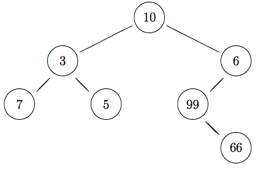

# Homework 9

## Due Date: Friday, December 18, 2020 (23h59)

- This homework is to be done individually. You may discuss problems
with fellow students, but all submitted work must be entirely your
own, and should not be from any other course, present, past, or
future. If you use a solution from another source you must cite it
&mdash; this includes when that source is someone else helping
you.

- **Please do not post your solutions on a
public website or a public repository like GitHub.**

- All programming is to be done in OCaml v4.

- Code your answers by modifying the file
[`homework9.ml`](homework9.ml) provided. Add your **name**, your
**email address**, and any **remarks** that you wish to make to the
instructor to the block comment at the head of the file.

- **Please do not change the types in the signature of the
function stubs I provide**. Doing so will make it
impossible to load your code into the testing infrastructure,
and make me unhappy.

- Feel free to define helper functions if you need them.

## Electronic Submission Instructions

- Start a _fresh_  OCaml shell.

- Load your homework code via `#use "homework9.ml";;` to make sure that there will be no errors when I load your code.

- If there are any error, do not submit. I can't test what I can't `#use`.

- When you're ready to submit, send an email with your file
`homework9.ml` as an attachment to `olin.submissions@gmail.com` with
subject _Homework 9 submission_.

* * *

## Question 1: Binary Trees

A _binary tree_ is a tree in which every node has at most
two children (a left child and a right child). A binary tree may be
empty. We consider binary trees in which every node stores a
value:
	

Here is an OCaml type for binary trees that can store values of
type `'a` at the nodes:

    type 'a bintree = 
       | Empty
       | Node of 'a * 'a bintree * 'a bintree

The sample tree above can be constructed using

    let sample = 
      Node(10, Node(3, Node(7, Empty, Empty),
                       Node(5, Empty, Empty)),
               Node(6, Node(99, Empty, 
                                Node(66, Empty, Empty)),
                       Empty))

A function `pbt` (for _print binary tree_) has been provided to
print an _integer_ binary tree. (If you have other kinds of
binary trees, then you're going to have to define your own printing
function.)

    # pbt sample;;
    +--- 6
    |    |    +--- 66
    |    +--- 99
    10
    |    +--- 5
    +--- 3
         +--- 7
    - : unit = ()

It takes a bit of time to read this
output easily, but it's basically the tree rotated counter-clockwise
90 degrees: the root is on the left (10), and the tree grows to the
right. Create a few trees, and print them out to see what they look
like.

Function over trees, just like functions over lists, are naturally
recursive. That follows directly from the recursive nature of trees.

### (A)

Code functions **`size`** and **`height`** of type **`'a bintree -> int`** and  a function **`sum`** of type **`int bintree -> int`**, which respectively return the total number of nodes, the height, and the sum of the values of a binary tree. 

(Recall that the height of a tree is the number of nodes in its longest branch.)

    # size Empty;;
    - : int = 0
    # size (Node(1,Empty,Empty));;
    - : int = 1
    # size sample;;
    - : int = 7
    # height Empty;;
    - : int = 0
    # height (Node(1,Empty,Empty));;
    - : int = 1
    # height sample;;
    - : int = 4
    # sum Empty;;
    - : int = 0
    # sum (Node(1,Empty,Empty));;
    - : int = 1
    # sum sample;;
    - : int = 196

### (B)

Code a function **`leaves`** of
type **`'a bintree -> 'a list`** that
returns the list of leaves of a tree from left to right, where a leaf is a node with no children. 

    # leaves Empty;;
    - : 'a list = []
    # leaves (Node(1,Empty,Empty));;
    - : int list = [1]
    # leaves (Node(1,Node(2,Empty,Empty),Node(3,Empty,Empty)));;
    - : int list = [2; 3]
    # leaves sample;;
    - : int list = [7; 5; 66]

### (C)

Trees support higher-order functions similar to those for lists.

Code a function **`map`** of
type **`('a -> 'b) -> 'a bintree -> 'b bintree`** where `map f t` returns a new tree
with the same shape as `t` but where the value of
every node has been transformed via function `f`.

    # map (fun x -> x * x) Empty;;
    - : int bintree = Empty
    # map (fun x -> x * x) (Node(2,Empty,Empty));;
    - : int bintree = Node(4, Empty, Empty)
    # pbt (map (fun x -> x * x) (Node(2,Node(3,Empty,Empty),Node(4,Empty,Empty))));;
    +--- 16
    4
    +--- 9
    - : unit = ()
    # pbt (map (fun x -> x * x) sample);;
    +--- 36
    |    |    +--- 4356
    |    +--- 9801
    100
    |    +--- 25
    +--- 9
         +--- 49
    - : unit = ()
    

### (D)

You can define a fold function for tree structures that generalizes
what `fold_right` does for lists. Intuitively, folding a tree means
starting from the lowest nodes and "rolling up" the nodes by applying
a function to the value of the nodes and the rolled up children, going
up so that you roll up the whole tree into a final value. (In a
similar way, you can think of `fold_right` as "rolling up" a list
starting from the end of the list, at every step applying a function
to the current element of the list and the rolled up rest of the list,
going all the way to the beginning so that you roll up the whole list
into a final value.)

Code a function **`fold`** of type **`('a -> 'b -> 'b -> 'b) -> 'a
bintree -> 'b -> 'b`** that does for binary trees what `fold_right`
does for lists. In particular, `fold f t b` should apply function `f`
to the root of tree `t`, being passed the value at the root and the
folded left and right subtrees. Folding an empty tree should return
base value `b`.

    # fold (fun v l r -> v+l+r) Empty 0;;
    - : int = 0
    # fold (fun v l r -> v+l+r) (Node(1,Empty,Empty)) 0;;
    - : int = 1
    # fold (fun v l r -> v+l+r) (Node(1,Empty,Empty)) 10;;
    - : int = 21
    # fold (fun v l r -> v+l+r) (Node(1,Node(2,Empty,Empty),Node(3,Empty,Empty))) 0;;
    - : int = 6
    # fold (fun v l r -> v+l+r) sample 0;;
    - : int = 196
    

### (E)

A _traversal_ for a tree is a listing of the
values in the tree in some specific order. 
A _preorder_ traversal lists the value of a node
_before_ the values of the nodes of its subtrees; a
_postorder_ traversal lists the values of a node
after the values of its subtrees; and an _inorder_
traversal lists the value of a node before the values of
its right subtree but after the values of its left
subtree.

Code function **`preorder`**, **`postorder`**, and **`inorder`**, each
of type **`'a bintree -> 'a list`**, which return the list of values
in a binary tree according to the given type of traversal. Try to
implement these functions using `fold`.

    # preorder Empty;;
    - : 'a list = []
    # preorder (Node(1,Empty,Empty));;
    - : int list = [1]
    # preorder (Node(1,Node(2,Empty,Empty),Node(3,Empty,Empty)));;
    - : int list = [1; 2; 3]
    # preorder sample;;
    - : int list = [10; 3; 7; 5; 6; 99; 66]
    # postorder Empty;;
    - : 'a list = []
    # postorder (Node(1,Empty,Empty));;
    - : int list = [1]
    # postorder (Node(1,Node(2,Empty,Empty),Node(3,Empty,Empty)));;
    - : int list = [2; 3; 1]
    # postorder sample;;
    - : int list = [7; 5; 3; 66; 99; 6; 10]
    # inorder Empty;;
    - : 'a list = []
    # inorder (Node(1,Empty,Empty));;
    - : int list = [1]
    # inorder (Node(1,Node(2,Empty,Empty),Node(3,Empty,Empty)));;
    - : int list = [2; 1; 3]
    # inorder sample;;
    - : int list = [7; 3; 5; 10; 99; 66; 6]

### (F)

A _binary search tree_ is a binary tree with
the following property: for every node N in the tree,
every node in the left subtree of N has value
less than the value at N, and every node in
the right subtree of N has value greater
than the value at N.

Code a function **`is_bst`** of type **`'a bintree -> bool`** where
`is_bst t` returns true exactly when `t` has the binary search tree
property.

    # is_bst Empty;;
    - : bool = true
    # is_bst (Node (10, Empty, Empty));;
    - : bool = true
    # is_bst (Node (10, Node (5, Empty, Empty), Empty));;
    - : bool = true
    # is_bst (Node (10, Empty, Node (20, Empty, Empty)));;
    - : bool = true
    # is_bst (Node (10, Node (5, Empty, Empty), Node(20, Empty, Empty)));;
    - : bool = true
    # is_bst (Node (10, Node(5, Node (2, Empty, Empty), Node(7, Empty, Empty)), Node (20, Node (15, Empty, Empty), Node (30, Empty, Empty)));;
    - : bool = true
    # is_bst (Node (10, Node(15, Node (2, Empty, Empty), Node(7, Empty, Empty)), Node (20, Node (15, Empty, Empty), Node (30, Empty, Empty))));;
    - : bool = false
    # is_bst (Node (10, Node(5, Node (6, Empty, Empty), Node(7, Empty, Empty)), Node (20, Node (15, Empty, Empty), Node (30, Empty, Empty))));;
    - : bool = false
    # is_bst (Node (10, Node(5, Node (2, Empty, Empty), Node(3, Empty, Empty)), Node (20, Node (15, Empty, Empty), Node (30, Empty, Empty))));;
    - : bool = false
    # is_bst (Node (10, Node(5, Node (2, Empty, Empty), Node(7, Empty, Empty)), Node (0, Node (15, Empty, Empty), Node (30, Empty, Empty))));;
    - : bool = false
    # is_bst (Node (10, Node(5, Node (2, Empty, Empty), Node(7, Empty, Empty)), Node (20, Node (25, Empty, Empty), Node (30, Empty, Empty))));;
    - : bool = false
    # is_bst (Node (10, Node(5, Node (2, Empty, Empty), Node(7, Empty, Empty)), Node (20, Node (5, Empty, Empty), Node (30, Empty, Empty))));;
    - : bool = false
    # is_bst (Node (10, Node(5, Node (2, Empty, Empty), Node(7, Empty, Empty)), Node (20, Node (15, Empty, Empty), Node (1, Empty, Empty))));;
    - : bool = false
    # is_bst (Node (10, Node(5, Node (2, Empty, Empty), Node(7, Empty, Empty)), Node (20, Node (15, Empty, Empty), Node (19, Empty, Empty))));;
    - : bool = false

**Hint**: you're probably going to need helper functions...

* * * 

## Question 2: Arithmetic Expressions

Consider the following type for (the abstract syntax tree of) arithmetic expressions:

    type exp =
    
      (* PART A *)
      | Num of int                
      | Ident of string
      | Plus of exp * exp
      | Times of exp * exp
    
      (* PART B *)
      | EQ of exp * exp           
      | GT of exp * exp
      | And of exp * exp
      | Not of exp
      | If of exp * exp * exp
    
      (* PART C *)
      | Letval of string * exp * exp    
    
      (* PART D *)
      | Letfun of string * string * exp * exp      
      | App of string * exp

We won't be using all constructors at once.

We will be writing an _evaluation function_ that takes
an expression written as an abstract syntax tree as above, and
evaluates it down to a value.  To deal with identifiers
(variables) appearing in an expression, we supply
an _environment_ to the evaluation function which tells
the evaluation which integer each identifier is mapped
to. An environment is just a function `string -> T`
where `T` is the type of values that the environment
stores. Mostly, we'll be working with integer environments,
where `T` is `int`. I've supplied you with two
environment-manipulating functions:
	
    let init : int env = (fun x -> 0)
    
    let update (env:'a env) (x:string) (v:'a):'a env =
      (fun y -> if (x=y) then v else env y
	
Value `init` is an initial integer environment that
maps every identifier to 0. Function `update` takes an
environment `env`, an identifier `x` and a
value `v`, and returns a new environment which
maps `x` to `v` and maps every other identifier
to whatever the original environment `env` maps it
to. Thus, `update init x 10` is an environment that
maps `x` to 10 and every other identifier to 0.
					  

### (A)

Code a function **`eval`** of
type **`exp -> int env -> int`**
where `eval exp env` takes an
expression `exp` using only
constructors `Num`, `Ident`, `Plus`,
and `Times` and an environment `env` and
returns the result of evaluating `exp` with
environment `env` to resolve identifiers. You can
use `failwith` to return an error if you encounter another
constructor.

Intuitively, a `Num` evaluates to the number
itself, an idenfitier `Ident` evaluates to whatever
the environment says it maps to, and `Plus`
and `Times` evaluate to the result of adding or
multiplying the values to which the subexpressions
evaluate to.

    # eval (Num 10) init;;
    - : int = 10
    # eval (Ident "x") init;;
    - : int = 0
    # eval (Plus(Num 10, Num 20)) init;;
    - : int = 30
    # eval (Plus(Num 10, Ident "x")) (update init "x" 2);;
    - : int = 12
    # eval (Times(Num 10, Ident "x")) (update init "x" 2);;
    - : int = 20
    # eval (Times(Plus(Num 10, Ident "y"), Ident "x")) (update init "x" 2);;
    - : int = 20
    # eval (Times(Plus(Num 10, Ident "x"), Ident "x")) (update init "x" 2);;
    - : int = 24
    # eval (Plus (Ident "x", Ident "y")) (update (update init "x" 42) "y" 10);;
    - : int = 52

### (B)

If we interpret integer 0 as _false_ and an
integer different from 0 as _true_, we can handle
Boolean operations and conditional evaluation in our
expressions.

Intuitively, `EQ` evaluates to true (that is,
any integer different from 0) if its two
arguments evaluate to the same value, while `GT`
evaluates to true (that is, any integer different from 0)
if its first argument evaluates to a 
value greater than the second
argument. They evaluate to false (0) otherwise.

Expression `And` evaluates to true (that is,
any integer different from 0) if both its arguments
evaluate to true, and evaluates to false (0) otherwise,
while expression `Not` evaluates to true
when its argument evaluates to false, and evaluates to
false otherwise.

Expression `If` is more interesting. It first
evaluates its first argument. If it is true, then it
evaluates its second argument and uses that as the result
of the overall evaluation of `If`. Otherwise, it
evaluates its 
third argument, and uses that as the result of the overall
evaluation of `If`.
      
Extend your function **`eval`** from
part A so that you can also evaluate expressions using
constructors `EQ`, `GT`, `And`, `Not`,
and `If`. 

    # eval (EQ (Num 10,Num 10)) init;;                                             
    - : int = 1                                                                    
    # eval (EQ (Num 10,Num 0)) init;;                                              
    - : int = 0                                                                    
    # eval (EQ (Plus (Num 1,Num 2), Num 2)) init;;                                 
    - : int = 0                                                                    
    # eval (GT (Num 10,Num 10)) init;;                                             
    - : int = 0                                                                    
    # eval (GT (Num 10,Num 0)) init;;                                              
    - : int = 1                                                                    
    # eval (GT (Plus (Num 1,Num 2), Num 2)) init;;                                 
    - : int = 1                                                                    
    # eval (And (Num 1,Num 1)) init;;                                              
    - : int = 1                                                                    
    # eval (And (Num 1,Num 0)) init;;                                              
    - : int = 0                                                                    
    # eval (Not (Num 1)) init;;                                                    
    - : int = 0                                                                    
    # eval (Not (Num 0)) init;;                                                    
    - : int = 1                                                                    
    # eval (And (Num 1, Not (Num 1))) init;;                                       
    - : int = 0                                                                    
    # eval (And (Num 0, Not (Num 0))) init;;                                       
    - : int = 0                                                                    
    # eval (If (EQ (Ident "x", Num 42), Num 100, Num 200)) init;;                  
    - : int = 200                                                                  
    # eval (If (EQ (Ident "x", Num 42), Num 100, Num 200)) (update init "x" 42);;  
    - : int = 100                                                                  

### (C)

We haven't really manipulated the environment during
evaluation. We can easily define names for values during
evaluation using constructor `Letval`.

Intuitively, expression `Letval (x,e1,e2)`
evaluates `e1` to an integer _n_, and then
evaluates `e2` in the environment updated to map
identifier `x` to _n_.

Extend your function **`eval`** from
part A and B so that you can also evaluate expressions using
constructor `Letval`.

    # eval (Letval ("x",Num 42, Plus (Ident "x",Num 1))) init;;
    - : int = 43
    # eval (Letval ("x",Num 42, Letval ("y",Num 10, Plus (Ident "x",Ident "y")))) init;;
    - : int = 52
    # eval (Letval ("x",Num 42, Letval ("y",Plus(Ident "x", Num 10),
                    Times (Ident "y", Num 2)))) init;;
    - : int = 104  
    # eval (Letval ("x",Letval("y",Num 1,Plus(Ident "y",Num 2)),
                    Times(Ident "x",Num 4))) init;;
    - : int = 12 

### (D)  (EXTRA Question for no credit except bragging rights)
	  
Using `Letval` to create names for values is nice enough, but it would
be really great if we could write _functions_ in our expressions
language that simplify the writing of complex
expressions. Constructors `Letfun` and `App` let us do just that.

Intuitively, `Letfun (f, x, e1, e2)` defines a (nonrecursive) function
called `f` that takes a single parameter `x` and has body `e1`.
Calling `f` with an integer _n_ amounts to evaluating `e1` in an
environment extended so that parameter `x` maps to _n_. The function
definition is available during the evaluation of `e2`, whose result is
the result of the overall evaluation of `Letfun`. Expression `App` is
used to _apply_ a function. It takes a function name (a string) and an
expression, evaluates the expression to a value, and calls the
function with that value to get the final result.

We can't store functions in the environment, because
the environment can only store values of
type `int`. So we are going to use a second
environment, a function environment, to store values of
type `int -> int`, and pass that function
environment around along with the normal
environment.

I have provided you with an initial function environment `initF`
that assigns an undefined function to every
function name.

Code a function **`evalF`** of type **`exp -> int env -> (int -> int)
env -> int`** where `evalF exp env fenv` takes an expression `exp`
using all the constructors in `exp`, an environment `env`, a function
environment `fenv`, and returns the result of evaluating `exp` with
environment `env` to resolve identifiers and function environment
`fenv` to resolve function names. (No, you won't get to reuse
`eval`. You'll need to rewrite the whole evaluation function from
scratch.)

    # evalF (Letfun ("square", "x", Times(Ident "x", Ident "x"),
                     App("square", Num 10))) init initF;;
    - : int = 100
    # evalF (Letfun ("square", "x", Times(Ident "x", Ident "x"),
                     Letfun ("double", "y", Times(Num 2, Ident "y"),
                             App ("double", App ("square", Num 42))))) init initF;;
    - : int = 3528

Oh, and congratulations! You're halfway through writing an interpreter for OCaml.
